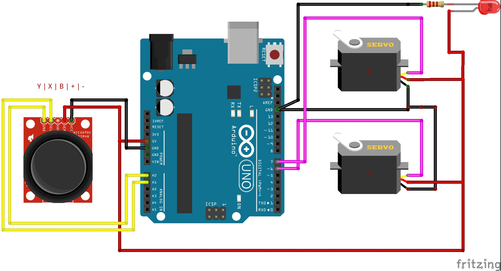

# Turret

  

> Version: **1.0.0**

---

## Table of Contents

- [About](#about)
- [Components](#components)
- [Schematic](#schematic)
- [Installation](#installation)
- [Usage](#usage)
- [Changelog](#changelog)
- [Contributing](#contributing)
- [License](#license)
- [Authors](#authors)

## About

`Turret` is a project that aims to create a turret that can be controlled remotely via a joystick.

> **Note:** This project can be used for any project that uses a joystick and servos.

## Components

- 1x Arduino Uno
- 1x Joystick
- 2x Servos
- 1x Breadboard
- Some wires

## Schematic

## Installation

1. Clone the repository
2. Open the `turret.ino` file in the Arduino IDE
4. Upload the code to the Arduino Uno

## Usage

1. Connect the Arduino Uno to the computer
3. Move the joystick to control the servos

## Changelog

see [CHANGELOG.md](CHANGELOG.md) for changes

## Contributing

Contributing is disabled for this repository

## License

This project is licensed under the AGPL v3 License - see the [LICENSE](LICENSE.md) file for details

## Authors

- [@Zarox28](https://github.com/Zarox28)